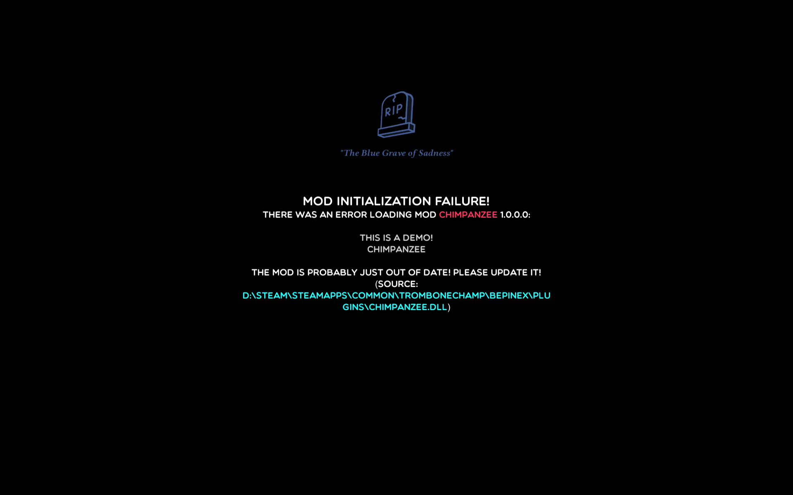

# Game Initialization API

```
[hide]
open System
```

```
open BaboonAPI.Hooks.Initializer
```

The initialization API lets you perform fallible setup tasks during
game startup.

```
type ChimpanzeePlugin() =
    inherit BaseUnityPlugin()
    
    member this.Awake() =
        GameInitializationEvent.EVENT.Register this
    
    interface GameInitializationEvent.Listener with
        member this.Initialize() =
            GameInitializationEvent.attempt this.Info (fun () ->
                raise (Exception "Oh no! We hit a problem while loading!")
            )
```

Any exception thrown inside the initializer callback will be caught,
and the game will safely stop loading and report the problem to the player.



## C# Example

```csharp
using BaboonAPI.Hooks.Initializer;
using BepInEx;
using HarmonyLib;

namespace Chimpanzee
{
    [BepInPlugin("ch.offbeatwit.chimpanzee", "Chimpanzee", "1.0.0.0")]
    [BepInDependency("ch.offbeatwit.baboonapi.plugin")]
    public class ChimpanzeePlugin : BaseUnityPlugin
    {
        private Harmony _harmony = new Harmony("ch.offbeatwit.chimpanzee");
    
        private void Awake()
        {
            // Register the initialization callback
            GameInitializationEvent.Register(Info, TryInitialize);
        }
        
        private void TryInitialize() {
            // Do your setup tasks in here!
            // For example: if Harmony can't find the method to be patched,
            // or if a transpiler goes really wrong, it will throw!
            _harmony.PatchAll();
        
            // Throwing an exception in here will safely stop the game loading. 
            throw new Exception("Oh no! We hit a problem while loading!");
        }
    }
}
```
